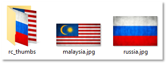
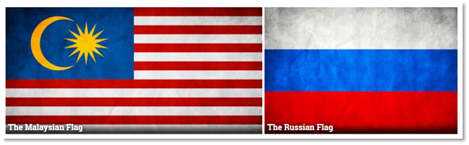

# Image titles

> [!NOTE]
> The following is an advanced feature, which will take a little time to set up.

If you like having titles showing over your image thumbnails, but would prefer not to use the image’s file names, you can specify your own titles. To do this, follow these steps:

* In the plugin’s admin page (**Extensions > Plugins > RC Gallery**), enable the "**Get titles from labels.txt**" option, and choose how you’d like image titles to be displayed.

* Create a new text file, and place it in the folder with your images. This file should be called labels.txt.

* For each image in the folder, you should enter one row of text.

* On each row, you must first specify the file name, then the image title, separating them with a | (a vertical bar, or ‘pipe’).

This is better explained through an example. Let’s say on my server I have a folder called "flags", with the following file contents:



My text file would need to be saved into that same folder, and would contain the following:

```js
malaysia.jpg|The Malaysian Flag
russia.jpg|The Russian Flag
```

The result of this would be as follows:



## Some points to note when using `labels.txt`

Some other gallery extensions you may have used also use a ‘labels.txt’ file, and this file’s structure won’t always be the same from one extension to the next. However, most start with the file name followed by the image, which means that they will work with this plugin. Any files that are not in the correct format will essentially be ignored. Any other fields entered after the first two will also be ignored.

Although I have in the example above, you don’t have to specify the files in any particular order. Nor does the order you specify them in, have any impact on the order they’re displayed in.

Files not specified in the ‘labels.txt’ file will still be included, but will be assigned a title based on their file name.

You can include **html** tags in your image titles e.g:

```html
imagefile.jpg|<em>Learn more</em>
```

...would give you an emphasised title. The result of this will depend on the CSS in your template. Be careful using html in your titles though, as it can make a mess of things if you go too far.
