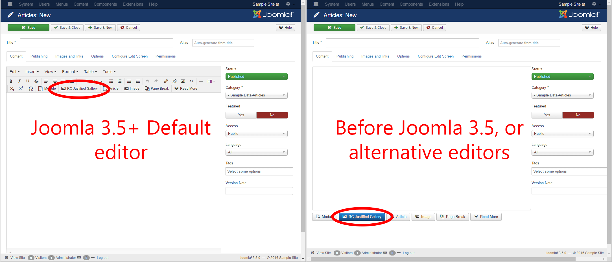
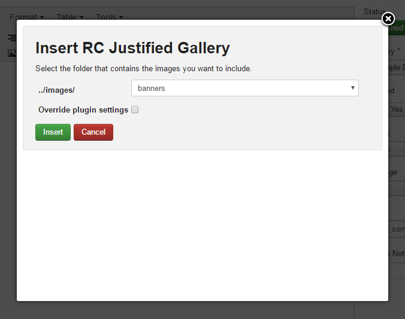
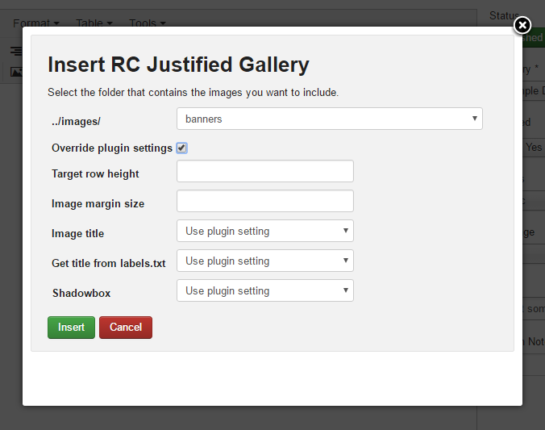

# Include in an article

> [!NOTE]
> Note that this step assumes you’ve already installed and enabled the plugins.

## Using the editor button add-on (installed separately)

Including galleries in your articles is simple, particularly if you’ve also installed the editor button add-on (which is recommended). Assuming you’ve enabled both of the plugins, you’ll see a button on the article editor.



Clicking this button will open a popup (fig. 2), which lets you choose the folder your images are stored in. Once you’ve chosen, just click “insert”. That’s it!



You might want to override some of the plugin’s settings for the particular gallery you’re adding. In that case, check the box marked “Override plugin settings”. More info on what these settings do can be found in the settings section of this manual.



## Manual method

If you prefer not to use the editor button, you can add galleries to your articles by just including this text anywhere in your article:

```
{gallery}my/folder{/gallery}
```

By default this would include images from the folder `yourjoomlasite.com/images/my/folder`.
